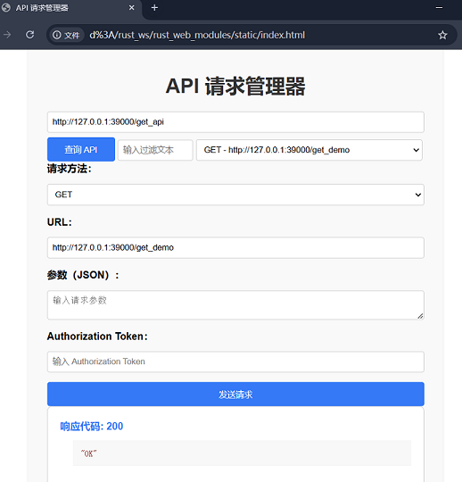
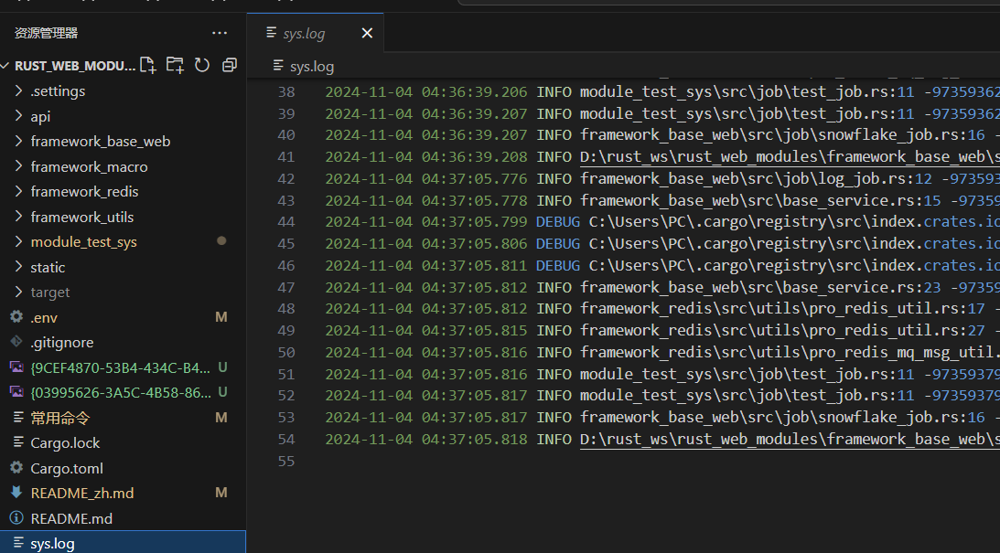

**其他语言版本: [English](README_en.md), [中文](README.md).**


**一个基于 Rust 和 Axum 构建的 Web 应用程序**

## 项目介绍

此项目还没有经过生产环境的运行测试,使用需要仔细测试,欢迎大家提交bug

项目是一款基于 Rust 构建的高性能 Web 应用程序框架。这不是一个工具库,只是基于常用的工具类,进行的一个整合。通过巧妙运用 Rust 宏配合对应的类库，大幅简化了常见开发任务，降低了开发门槛。结合 Rust 的性能优势和类型安全特性，以及现代 Web 开发技术，该框架能帮助开发者高效构建可靠、可维护的 Web 应用。

## 功能概述

* **Web 服务：** 使用 Axum 框架构建高效的 Web 服务。
* **数据库交互：** 连接 MySQL 数据库，实现数据存储和查询。
* **异步处理：** 利用 tokio 提供的异步运行时，提升并发性能。
* **JSON 处理：** 使用 serde 进行 JSON 数据的序列化和反序列化。
* **配置管理：** 支持通过环境变量和 JSON 配置文件进行配置。
* **日志记录：** 使用 log 和 env_logger 记录应用程序运行日志。
* **ID 生成：** 使用 idgenerator 生成ID。
* **缓存：** 使用 r2d2_redis 进行数据缓存。

## 技术栈

* **Rust:** 作为主要开发语言。
* **Axum:** Web 框架。
* **SQLx:** 数据库 ORM。
* **Tokio:** 异步运行时。
* **Serde:** 序列化/反序列化。

## 模块介绍


## framework_base_web 模块

**模块概述**

作为框架的基础，framework_base_web 模块提供了 Web 应用开发所需的通用功能，包括：

* **配置加载与日志处理:**
    * `init_config.rs`: 加载 .env 配置文件，并初始化日志系统。
* **用户认证与授权:**
    * `layer_util.rs`: 实现用户登录鉴权功能。
* **数据库连接:**
    * `base_service.rs`: 初始化数据库连接，为后续数据操作提供基础。
* **本地缓存:**
    * `pro_local_cache_util.rs`: 提供本地缓存工具类，支持内存缓存和基于 SQLite 的磁盘缓存。
* **dto:**
    这个dto包主要用于封装各种类型的数据，以便在系统不同模块之间传递。这些数据包括：日志,分页,登录用户信息
* **job:**
    定时任务包,里面包含类定时将日志写入文件,和分布式雪花算法id续期,避免多台机器时,雪花算法id冲突
* **utils:**
    * `pro_base_security_util.rs`: 处理登录用户信息工具类,加密,解密,配合THREAD_LOCAL在代码中任意一个流程轻松提取登录用户信息
    * `pro_local_cache_util.rs`: 提供本地缓存工具类，支持内存缓存和基于 SQLite 的磁盘缓存。
    * `pro_sql_query_util.rs`: 支持数据库相关使用的工具类

## framework_macro 模块

**模块概述**

framework_macro 在 Rust 中，宏模块是一种强大的元编程工具，它允许开发者在编译时对代码进行操作，实现代码的生成、抽象和定制。

* **macro_str_util.rs:**
    宏使用的字符串工具类
* **control.rs:**
    处理axum接口,扫描加了#[control]的impl,获取到get,post,delete的接口,添加到宏中的MAP函数中,生成 init_control 空代码,用于服务启动时调用,刺激生成宏, #[add_route] 宏,读取#[control]生成的MAP函数,将接口生成添加到axum的代码返回
* **job.rs:**
    定义了一些与任务调度相关的宏，#[interval_job...]在单台服务器上定时间隔执行的任务,#[redis_lock_job...]基于redis分布式锁,在多台服务器间隔执行的锁
* **table.rs:**
    基于sqlx定义了一些与表增删改查操作相关的宏.
* **pro_json_ser_der.rs:**
    基于serde 定义了一些JSON序列化和反序列化相关的宏，用于处理JSON数据。增强了json序列化时的兼容性,将数字序列化为字符串,避免不同环境因为数字精度导致异常,并提供了将蛇形字段转换为驼峰字段,主要是和js交互
* **redis_mq.rs 和 redis_mq_que_model.rs:**
    这个模块定义了一些与Redis消息队列广播相关的宏，用于发送、接收消息等。


## framework_redis 模块

**模块概述**

该模块提供了一套基于 Redis 的常用操作封装，简化 Redis 的使用，提供如分布式锁、消息队列等功能

## framework_utils 模块

**模块概述**

framework_utils 模块是一个 通用工具类模块，为项目提供一系列常用的实用函数和数据结构，以简化开发过程。


## module_test_sys 模块

**模块概述**

项目使用demo模块


请求使用demo

先定义一个control, get,post和请求demo1

```rust
pub struct TestControl {}

#[control]
impl TestControl {

    // pro_anonymous 匿名访问注解
    #[pro_anonymous]
    #[get("/get_demo")]
    pub async fn get_demo() -> impl IntoResponse {
        println!("get_demo");
        Json("OK")
    }

    // pro_anonymous 匿名访问注解 
    #[pro_anonymous]
    #[get("/post_demo")]
    pub async fn post_demo() -> impl IntoResponse {
        println!("post_demo");
        Json("OK")
    }

```

在main函数中注册一下control
```rust
#[tokio::main]
async fn main() {
    ...
    // 初始化路由
    init_route();
    ...

    // 启动服务器
    let app = get_app();

    // 提取路由信息,包含是get还是post方法,请求地址等等
    let route_map = get_route();

    // 合并路由信息,包含是get还是post方法,请求地址等等
    init_config::init_server(app, route_map).await;

}


// 初始化路由
fn init_route() {
    // redis初始化
    TestControl::init_control();
}


```

打开D:\rust_ws\rust_web_modules\static\index.html点击查询api,获取接口列表


选择get请求,post请求,即输出如下
```
...
2024-11-04 04:37:05.817 INFO module_test_sys\src\job\test_job.rs:11 -9735937967783941- 开始执行定时任务:test_job_pub
2024-11-04 04:37:05.817 INFO framework_base_web\src\job\snowflake_job.rs:16 -9735937967783941- 开始执行定时任务:SnowflakeJob
2024-11-04 04:37:05.818 INFO D:\rust_ws\rust_web_modules\framework_base_web\src\config\init_config.rs:112 -9735937967783941- 服务器启动成功,地址127.0.0.1:39000
get_demo
post_demo
```

同时会在本地生成一个日志文件



定时任务和基于redis的队列和广播消息demo

先定义一个 job , 
interval_job表示在服务器上间隔执行的job , 
redis_lock_job表示分布式锁下,间隔执行的任务

```rust

// 本地缓存清理定时任务
pub struct TestJobQue {}

#[job]
impl TestJobQue {
    
    // 间隔执行,向redis队列key放入一个雪花算法生成的id
    #[interval_job(job_name = "test_job_que", interval_millis = 10000)]
    pub async fn test_job_que() {
        pro_redis_mq_msg_util::put_msg_que("key", IdInstance::next_id());
    }
    
    // 分布式锁定时任务,向redis广播test_job_pub 放入一个雪花算法生成的id
    #[redis_lock_job(job_name = "test_job_pub", interval_millis = 10000)]
    pub async fn test_job_pub() {
        pro_redis_mq_msg_util::put_msg_pub("test_job_pub", IdInstance::next_id());
    }

}

```

redis mq 接收消息

```rust

pub struct TestMqQue {}

#[redis_mq]
impl TestMqQue {

    // redis 队列 ,接收key的消息
    #[redis_mq_que(que = "key", group = "sys_group")]
    pub async fn test_job_que(data: i64) {
        println!("test_job_que:{}", data);
    }

    // redis 广播 ,函数test_job_pub1,接收test_job_pub 的消息
    #[redis_mq_pub("test_job_pub")]
    pub async fn test_job_pub1(data: i64) {
        println!("test_job_pub1:{}", data);
    }
    
    // redis 广播 ,函数test_job_pub2,接收test_job_pub 的消息
    #[redis_mq_pub("test_job_pub")]
    pub async fn test_job_pub2(data: i64) {
        println!("test_job_pub2:{}", data);
    }

}


```


在main函数中注册一下job和mq
```rust

#[tokio::main]
async fn main() {

    ...

    // 初始化定时任务模块
    init_job();

    init_mq();

    ...

}

// 初始化定时任务模块
fn init_job() {
    TestJobQue::init_job();
}

// 初始化定时任务模块
fn init_mq() {
    TestMqQue::init_mq();
}


```

启动效果
```
2024-11-04 05:41:27.566 INFO framework_base_web\src\job\snowflake_job.rs:16 -9736191051300869- 开始执行定时任务:SnowflakeJob
2024-11-04 05:41:27.567 INFO D:\rust_ws\rust_web_modules\framework_base_web\src\config\init_config.rs:112 -9736191051300869- 服务器启动成功,地址127.0.0.1:39000
test_job_pub2:9736191382650885
test_job_pub1:9736191382650885
test_job_que:9736191382519813
test_job_pub1:9736191709741061
test_job_pub2:9736191709741061
test_job_que:9736191709609990
test_job_pub2:9736192038010885
test_job_pub1:9736192038010885


```


数据库查询demo

创建表

```

CREATE TABLE `test` (
  `id` bigint NOT NULL,
  `create_by` bigint DEFAULT NULL,
  `create_time` datetime(6) DEFAULT NULL,
  `update_by` bigint DEFAULT NULL,
  `update_time` datetime(6) DEFAULT NULL,
  `version` int DEFAULT NULL,
  `str_column` varchar(255) CHARACTER SET utf8mb4 COLLATE utf8mb4_bin DEFAULT NULL,
  `f32_column` float DEFAULT NULL,
  `json_column` json DEFAULT NULL,
  `enum_column` varchar(255) CHARACTER SET utf8mb4 COLLATE utf8mb4_bin DEFAULT NULL
) ENGINE=InnoDB DEFAULT CHARSET=utf8mb4 COLLATE=utf8mb4_bin ROW_FORMAT=DYNAMIC;

```

创建实体类

需要注意,下面这几个字段会被宏管理更新 create_by,create_time,update_by,update_time,version , 不需要手动设置值
create_by,update_by会从pro_base_security_util::get_login_user_id()中读取值维护


```rust

// 通过宏为模板生成增删改查的方法
#[table(test)]
// 指定字段序列化方式,数字序列化为字符串,蛇形字段改为驼峰,空字段序列化为Option的None等等
#[pro_json_ser_der]
pub struct Test {
    #[id]
    pub id: Option<i64>,
    pub create_by: Option<i64>,
    pub create_time: Option<DateTime<Utc>>,
    pub update_by: Option<i64>,
    pub update_time: Option<DateTime<Utc>>,
    pub version: Option<i32>,
    pub str_column: Option<String>,
    pub f32_column: Option<f32>,
    // 测试json枚举字段
    pub json_column: Option<Json<HashMap<String, Value>>>,
    // 测试枚举字段
    pub enum_column: Option<TestEnum>,
}


// 枚举列类型demo
#[derive(Debug, sqlx::Decode, sqlx::Encode, Serialize, Deserialize, Default, SqlEnum)]
#[sqlx]
pub enum TestEnum {
    #[default]
    Small,
    Medium,
    Large,
}


```

宏生成的表增删改查实现类,以表名首字母大写开头,SqlQuery结尾,

例如test表,对应的工具类TestSqlQuery

direct_开头的方法,表示这是一个静态方法,可以直接执行

接口测试

```rust

    // 查询一条打印
    #[pro_anonymous]
    #[get("/test_direct_find_by_id")]
    pub async fn test_direct_find_by_id() -> impl IntoResponse {
        let id: i64 = 9732915109888006;
        let direct_find_by_id = TestSqlQuery::direct_find_by_id(Box::new(id)).await.unwrap();
        println!(
            "test_direct_find_by_id:{}",
            pro_json_util::object_to_str_pretty(&direct_find_by_id)
        );
        Json("OK")
    }


```

日志输出
```

2024-11-04 06:26:27.706 DEBUG C:\Users\PC\.cargo\registry\src\index.crates.io-6f17d22bba15001f\sqlx-core-0.7.4\src\logger.rs:138 -9736368010428421- summary="SELECT `id`,`create_by`,`create_time`,`update_by`,`update_time`,`version`,`str_column`,`f32_column`,`json_column`,`enum_column` FROM `test` …" db.statement="\n\nSELECT\n  `id`,\n  `create_by`,\n  `create_time`,\n  `update_by`,\n  `update_time`,\n  `version`,\n  `str_column`,\n  `f32_column`,\n  `json_column`,\n  `enum_column`\nFROM\n  `test`\nWHERE\n  `id` = ?\n" rows_affected=0 rows_returned=1 elapsed=2.2815ms elapsed_secs=0.0022815
test_direct_find_by_id:{
  "id": "9732915109888006",
  "createBy": "0",
  "createTime": "2024-11-03T15:35:31.239965Z",
  "updateBy": "0",
  "updateTime": "2024-11-03T15:35:31.240203Z",
  "version": "2",
  "strColumn": "1",
  "f32Column": "11",
  "jsonColumn": {
    "k": "v"
  },
  "enumColumn": "Small"
}


```


个性化查询
```rust

    // 个性化查询
    #[pro_anonymous]
    #[get("/test_diy_find")]
    pub async fn test_diy_find() -> impl IntoResponse {
        let find_all = TestSqlQuery::new()
        .select((&[Test::FIELD_ID,Test::FIELD_VERSION ]).to_vec())
        .where_(Test::FIELD_ID, Condition::gt, Box::new(2))
        .limit(10)
        .find_all(|row|{
            let id:i64 = row.get(0);
            let version:i32 = row.get(1);
            return (id,version);
        }).await.unwrap();
        println!(
            "test_diy_find:{}",
            pro_json_util::object_to_str_pretty(&find_all)
        );
        Json("OK")
    }

```

输出结果
```
2024-11-04 06:56:41.780 INFO framework_base_web\src\job\snowflake_job.rs:16 -9736486894829573- 开始执行定时任务:SnowflakeJob
2024-11-04 06:56:41.780 INFO D:\rust_ws\rust_web_modules\framework_base_web\src\config\init_config.rs:112 -9736486894829573- 服务器启动成功,地址127.0.0.1:39000
2024-11-04 06:56:43.592 DEBUG C:\Users\PC\.cargo\registry\src\index.crates.io-6f17d22bba15001f\sqlx-core-0.7.4\src\logger.rs:138 -9736487016333317- summary="SELECT `id`,`version` FROM `test` …" db.statement="\n\nSELECT\n  `id`,\n  `version`\nFROM\n  `test`\nWHERE\n  `id` > ?\nLIMIT\n  10\n" rows_affected=0 rows_returned=10 elapsed=996.4µs elapsed_secs=0.0009964
test_diy_find:[
  [
    9732864687472645,
    1
  ],
  [
    9732915109888006,
    2
  ],
  [
    9733066038378502,
    2
  ],
  ......
```

分页查询
```rust


    // 分页查询,分页页码从1开始
    #[pro_anonymous]
    #[get("/test_direct_find_entities_by_page")]
    pub async fn test_direct_find_entities_by_page() -> impl IntoResponse {
        let direct_find_entities_by_page = TestSqlQuery::direct_find_paged_result(Test::default(), 1, 1).await;
        println!("direct_find_entities_by_page:{:?}" , direct_find_entities_by_page);
        Json("OK")
    }


```


输出结果
```
2024-11-04 15:09:58.667 DEBUG C:\Users\PC\.cargo\registry\src\index.crates.io-6f17d22bba15001f\sqlx-core-0.7.4\src\logger.rs:138 -9738426559168517- summary="SELECT COUNT(*) FROM `test`" db.statement="" rows_affected=0 rows_returned=1 elapsed=21.0005ms elapsed_secs=0.0210005
2024-11-04 15:09:58.696 DEBUG C:\Users\PC\.cargo\registry\src\index.crates.io-6f17d22bba15001f\sqlx-core-0.7.4\src\logger.rs:138 -9738426559168517- summary="SELECT `id`,`create_by`,`create_time`,`update_by`,`update_time`,`version`,`str_column`,`f32_column`,`json_column`,`enum_column` FROM `test` …" db.statement="\n\nSELECT\n  `id`,\n  `create_by`,\n  `create_time`,\n  `update_by`,\n  `update_time`,\n  `version`,\n  `str_column`,\n  `f32_column`,\n  `json_column`,\n  `enum_column`\nFROM\n  `test`\nORDER BY\n  `id` Desc\nLIMIT\n  1 OFFSET 0\n" rows_affected=0 rows_returned=1 elapsed=19.2336ms elapsed_secs=0.0192336
direct_find_entities_by_page:PageResult { content: [Test { id: Some(9733073162797061), create_by: Some(0), create_time: Some(2024-11-03T15:35:31.239965Z), update_by: Some(0), update_time: Some(2024-11-03T15:35:31.240203Z), version: Some(7), str_column: Some("1"), f32_column: Some(11.0), json_column: Some(Json({"k": String("v")})), enum_column: Some(Small) }], totalElements: 64, page: 1 }
error: process didn't exit successfully: `target\debug\module_test_sys.exe` (exit code: 0xc000013a, STATUS_CONTROL_C_EXIT)


```

事务操作demo
```rust

    // 事务操作demo
    #[pro_anonymous]
    #[get("/test_tx_exec")]
    pub async fn test_tx_exec() -> impl IntoResponse {
        {
            //一个成功的事务成功案例
            let result =
                TestSqlQuery::tx_exec(|mut tx: sqlx::Transaction<'_, sqlx::MySql>| async {
                    // 更新1
                    {
                        let id: i64 = 9732864687472645;
                        let direct_find_by_id =
                            TestSqlQuery::direct_find_by_id(Box::new(id)).await.unwrap();
                        let rows_affected =
                            TestSqlQuery::direct_update_by_exec(direct_find_by_id, &mut *tx)
                                .await
                                .rows_affected();
                        if rows_affected != 1 {
                            return (Err(ProException::事务执行异常), tx);
                        }
                    }

                    // 更新2
                    {
                        let id: i64 = 9732915109888006;
                        let direct_find_by_id =
                            TestSqlQuery::direct_find_by_id(Box::new(id)).await.unwrap();
                        let rows_affected =
                            TestSqlQuery::direct_update_by_exec(direct_find_by_id, &mut *tx)
                                .await
                                .rows_affected();
                        if rows_affected != 1 {
                            return (Err(ProException::事务执行异常), tx);
                        }
                    }

                    let ret: Result<&str, ProException> = Ok("OK");
                    (ret, tx)
                })
                .await;
            match result {
                Ok(data) => println!("data:{:?}", data),
                Err(err) => println!("err:{:?}", err),
            }
        }
        {
            //一个失败的事务案例
            let result =
                TestSqlQuery::tx_exec(|mut tx: sqlx::Transaction<'_, sqlx::MySql>| async {
                    // 成功更新1
                    {
                        let id: i64 = 9733066038378502;
                        let direct_find_by_id =
                            TestSqlQuery::direct_find_by_id(Box::new(id)).await.unwrap();
                        let rows_affected =
                            TestSqlQuery::direct_update_by_exec(direct_find_by_id, &mut *tx)
                                .await
                                .rows_affected();
                        if rows_affected != 1 {
                            return (Err(ProException::事务执行异常), tx);
                        }
                    }

                    // 失败更新2
                    {
                        let id: i64 = 9733066038706181;
                        let mut direct_find_by_id =
                            TestSqlQuery::direct_find_by_id(Box::new(id)).await.unwrap();

                        // 通过修改id,使得update失败
                        direct_find_by_id.id = Some( pro_snowflake_util::next_id() );

                        let rows_affected =
                            TestSqlQuery::direct_update_by_exec(direct_find_by_id, &mut *tx)
                                .await
                                .rows_affected();
                        if rows_affected != 1 {
                            return (Err(ProException::事务执行异常), tx);
                        }
                    }

                    let ret: Result<&str, ProException> = Ok("OK");
                    (ret, tx)
                })
                .await;
            match result {
                Ok(data) => println!("data:{:?}", data),
                Err(err) => println!("err:{:?}", err),
            }
        }

        Json("OK")
    }

```


输出结果
```
......
2024-11-06 05:33:54.169 DEBUG C:\Users\PC\.cargo\registry\src\index.crates.io-6f17d22bba15001f\sqlx-core-0.7.4\src\logger.rs:138 -9747485946544133- summary="SELECT `id`,`create_by`,`create_time`,`update_by`,`update_time`,`version`,`str_column`,`f32_column`,`json_column`,`enum_column` FROM `test` …" db.statement="\n\nSELECT\n  `id`,\n  `create_by`,\n  `create_time`,\n  `update_by`,\n  `update_time`,\n  `version`,\n  `str_column`,\n  `f32_column`,\n  `json_column`,\n  `enum_column`\nFROM\n  `test`\nWHERE\n  `id` = ?\n" rows_affected=0 rows_returned=1 elapsed=23.4512ms elapsed_secs=0.0234512
2024-11-06 05:33:54.170 INFO framework_base_web\src\utils\pro_base_security_util.rs:57 -9747485946544133- 没有从线程局部存储中获取到用户信息
2024-11-06 05:33:54.181 DEBUG C:\Users\PC\.cargo\registry\src\index.crates.io-6f17d22bba15001f\sqlx-core-0.7.4\src\logger.rs:138 -9747485946544133- summary="UPDATE `test` SET `id`=?,`create_by`=?,`create_time`=?,`update_by`=?,`update_time`=?,`version`=?,`str_column`=?,`f32_column`=?,`json_column`=?,`enum_column`=? …" db.statement="\n\nUPDATE\n  `test`\nSET\n  `id` = ?,\n  `create_by` = ?,\n  `create_time` = ?,\n  `update_by` = ?,\n  `update_time` = ?,\n  `version` = ?,\n  `str_column` = ?,\n  `f32_column` = ?,\n  `json_column` = ?,\n  `enum_column` = ?\nWHERE\n  `id` = ?\n  AND version = ?\n" rows_affected=0 rows_returned=0 elapsed=7.687ms elapsed_secs=0.007687
2024-11-06 05:33:54.181 ERROR module_test_sys\src\entities\test.rs:35 -9747485946544133- 事务执行异常:ProException { code: 116, message: "事务执行异常" }    
2024-11-06 05:33:54.198 DEBUG C:\Users\PC\.cargo\registry\src\index.crates.io-6f17d22bba15001f\sqlx-core-0.7.4\src\logger.rs:138 -9747485946544133- summary="ROLLBACK" db.statement="" rows_affected=0 rows_returned=0 elapsed=16.2574ms elapsed_secs=0.0162574
err:ProException { code: 116, message: "事务执行异常" }

```