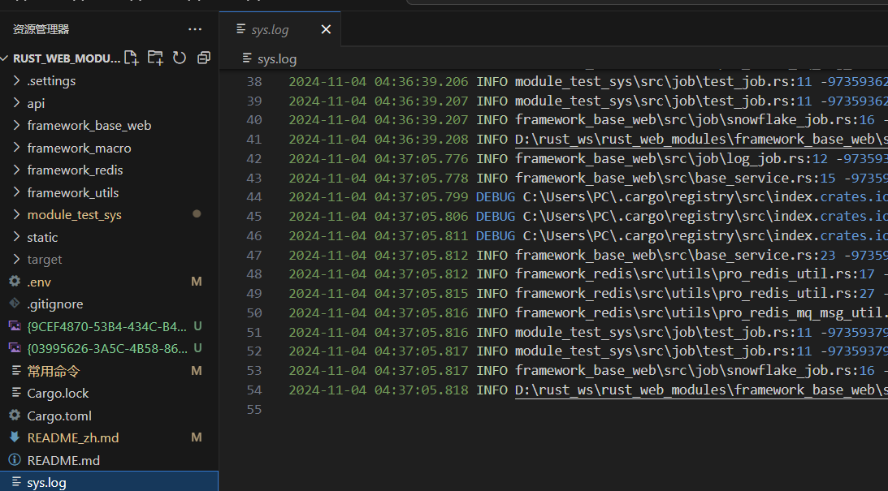

**Other Languages: [English](README_en.md), [中文](README.md).**

**A Web Application Built with Rust and Axum**

## Project Introduction
This project has not been tested in a production environment. It requires careful testing before use. Everyone is welcomed to submit bugs.
The project is a high-performance Web application framework built with Rust. It is not a tool library but an integration based on commonly used tool classes. By skillfully using Rust macros in combination with corresponding libraries, common development tasks are greatly simplified, and the development threshold is lowered. Combining the performance advantages and type safety features of Rust with modern Web development technologies, this framework can help developers efficiently build reliable and maintainable Web applications.

## Feature Overview
- **Web Services**: Use the Axum framework to build efficient Web services.
- **Database Interaction**: Connect to a MySQL database to achieve data storage and query.
- **Asynchronous Processing**: Utilize the asynchronous runtime provided by Tokio to improve concurrent performance.
- **JSON Processing**: Use Serde to perform serialization and deserialization of JSON data.
- **Configuration Management**: Support configuration through environment variables and JSON configuration files.
- **Logging**: Use Log and Env_Logger to record the running logs of the application.
- **ID Generation**: Use IdGenerator to generate IDs.
- **Caching**: Use R2D2_Redis to perform data caching.

## Technology Stack
- **Rust**: The main development language.
- **Axum**: Web framework.
- **SQLx**: Database ORM.
- **Tokio**: Asynchronous runtime.
- **Serde**: Serialization/Deserialization.

## Module Introduction

### framework_base_web Module
**Module Overview**
As the foundation of the framework, the framework_base_web module provides common functions required for Web application development, including:

- **Configuration Loading and Logging**:
    - `init_config.rs`: Loads the `.env` configuration file and initializes the logging system.
- **User Authentication and Authorization**:
    - `layer_util.rs`: Implements user login authentication and authorization functions.
- **Database Connection**:
    - `base_service.rs`: Initializes the database connection, providing the basis for subsequent data operations.
- **Local Caching**:
    - `pro_local_cache_util.rs`: Provides local caching utility classes, supporting in-memory caching and disk caching based on SQLite.
- **dto**:
    This dto package is mainly used to encapsulate various types of data for transfer between different modules in the system. These data include logs, pagination, and logged-in user information.
- **job**:
    The scheduled task package contains tasks such as writing logs to files at regular intervals and renewing the distributed Snowflake algorithm ID to avoid ID conflicts when multiple machines are involved.
- **utils**:
    - `pro_base_security_util.rs`: A utility class for handling logged-in user information, including encryption and decryption, allowing easy extraction of logged-in user information at any point in the code in combination with THREAD_LOCAL.
    - `pro_local_cache_util.rs`: Provides local caching utility classes, supporting in-memory caching and disk caching based on SQLite.
    - `pro_sql_query_util.rs`: Provides utility classes related to database usage.

### framework_macro Module
**Module Overview**
In Rust, the framework_macro module is a powerful metaprogramming tool that allows developers to operate on code during compilation, enabling code generation, abstraction, and customization.

- **macro_str_util.rs**:
    String utility classes used by macros.
- **control.rs**:
    Handles Axum interfaces, scans `impl` blocks annotated with `#[control]`, retrieves `get`, `post`, `delete` interfaces, adds them to the MAP function in the macro, generates empty `init_control` code to be called when the service starts, triggers macro generation, and the `#[add_route]` macro reads the `MAP` function generated by `#[control]` to return the code for adding interfaces to Axum.
- **job.rs**:
    Defines some macros related to task scheduling. `#[interval_job...]` represents tasks executed at regular intervals on a single server, and `#[redis_lock_job...]` represents tasks executed at intervals under a distributed Redis lock on multiple servers.
- **table.rs**:
    Based on SQLx, defines some macros related to table create, read, update, and delete operations.
- **pro_json_ser_der.rs**:
    Based on Serde, defines some macros related to JSON serialization and deserialization for handling JSON data. It enhances the compatibility of JSON serialization by serializing numbers as strings to avoid exceptions caused by different number precisions in different environments and provides the functionality to convert snake_case fields to camelCase fields, mainly for interaction with JavaScript.
- **redis_mq.rs and redis_mq_que_model.rs**:
    This module defines some macros related to Redis message queue broadcasting for sending and receiving messages.

### framework_redis Module
**Module Overview**
This module provides a set of commonly used operation encapsulations based on Redis, simplifying the use of Redis and providing functions such as distributed locks and message queues.

### framework_utils Module
**Module Overview**
The framework_utils module is a general utility class module that provides a series of commonly used utility functions and data structures for the project to simplify the development process.

### module_test_sys Module
**Module Overview**
This is the project's demo module.

## Request Usage Demo
First, define a `control`, `get`, `post`, and request demo1:

```rust
pub struct TestControl {}

#[control]
impl TestControl {

    // pro_anonymous anonymous access annotation
    #[pro_anonymous]
    #[get("/get_demo")]
    pub async fn get_demo() -> impl IntoResponse {
        println!("get_demo");
        Json("OK")
    }

    // pro_anonymous anonymous access annotation
    #[pro_anonymous]
    #[get("/post_demo")]
    pub async fn post_demo() -> impl IntoResponse {
        println!("post_demo");
        Json("OK")
    }
```

In the `main` function, register the `control`:

```rust
#[tokio::main]
async fn main() {
    // 初始化路由
    init_route();

    // 启动服务器
    let app = get_app();

    // 提取路由信息，包含是get还是post方法、请求地址等
    let route_map = get_route();

    // 合并路由信息，包含是get还是post方法、请求地址等
    init_config::init_server(app, route_map).await;
}


// 初始化路由
fn init_route() {
    // 初始化Redis
    TestControl::init_control();
}
```

Open `D:\rust_ws\rust_web_modules\static\index.html`, click to query the API to get the list of interfaces.


Select `get` request or `post` request, and the output will be as follows:

```
...
2024-11-04 04:37:05.817 INFO module_test_sys\src\job\test_job.rs:11 -9735937967783941- Starting to execute scheduled task: test_job_pub
2024-11-04 04:37:05.817 INFO framework_base_web\src\job\snowflake_job.rs:16 -9735937967783941- Starting to execute scheduled task: SnowflakeJob
2024-11-04 04:37:05.818 INFO D:\rust_ws\rust_web_modules\framework_base_web\src\config\init_config.rs:112 -9735937967783941- Server started successfully, address: 127.0.0.1:39000
get_demo
post_demo
```

At the same time, a local log file will be generated.


## Demo of Scheduled Tasks, Redis-based Queues, and Broadcast Messages
First, define a job. `interval_job` represents a job executed at intervals on the server, and `redis_lock_job` represents a task executed at intervals under a distributed lock.

```rust
// Local cache cleaning scheduled task
pub struct TestJobQue {}

#[job]
impl TestJobQue {

    // Execute at intervals, put a Snowflake algorithm-generated ID into the Redis queue key
    #[interval_job(job_name = "test_job_que", interval_millis = 10000)]
    pub async fn test_job_que() {
        pro_redis_mq_msg_util::put_msg_que("key", IdInstance::next_id());
    }

    // Distributed lock task, put a Snowflake algorithm-generated ID into the Redis broadcast test_job_pub
    #[redis_lock_job(job_name = "test_job_pub", interval_millis = 10000)]
    pub async fn test_job_pub() {
        pro_redis_mq_msg_util::put_msg_pub("test_job_pub", IdInstance::next_id());
    }
}
```

Redis MQ message receiving:

```rust
pub struct TestMqQue {}

#[redis_mq]
impl TestMqQue {

    // Redis queue, receive messages from the key
    #[redis_mq_que(que = "key", group = "sys_group")]
    pub async fn test_job_que(data: i64) {
        println!("test_job_que:{}", data);
    }

    // Redis broadcast, function test_job_pub1, receive messages from test_job_pub
    #[redis_mq_pub("test_job_pub")]
    pub async fn test_job_pub1(data: i64) {
        println!("test_job_pub1:{}", data);
    }

    // Redis broadcast, function test_job_pub2, receive messages from test_job_pub
    #[redis_mq_pub("test_job_pub")]
    pub async fn test_job_pub2(data: i64) {
        println!("test_job_pub2:{}", data);
    }
```

In the `main` function, register the job and MQ:

```rust
#[tokio::main]
async fn main() {
    // 初始化定时任务模块
    init_job();

    init_mq();

    // 启动服务器
    let app = get_app();

    // 提取路由信息，包含是get还是post方法、请求地址等
    let route_map = get_route();

    // 合并路由信息，包含是get还是post方法、请求地址等
    init_config::init_server(app, route_map).await;
}


// 初始化定时任务模块
fn init_job() {
    TestJobQue::init_job();
}

// 初始化定时任务模块
fn init_mq() {
    TestMqQue::init_mq();
}
```

Startup effect:

```
2024-11-04 05:41:27.566 INFO framework_base_web\src\job\snowflake_job.rs:16 -9736191051300869- Starting to execute scheduled task: SnowflakeJob
2024-11-04 05:41:27.567 INFO D:\rust_ws\rust_web_modules\framework_base_web\src\config\init_config.rs:112 -9736191051300869- Server started successfully, address: 127.0.0.1:39000
test_job_pub2:9736191382650885
test_job_pub1:9736191382650885
test_job_que:9736191382519813
test_job_pub1:9736191709741061
test_job_pub2:9736191709741061
test_job_que:9736191709609990
test_job_pub2:9736192038010885
test_job_pub1:9736192038010885
```

## Database Query Demo

### Create Table
```sql
CREATE TABLE `test` (
  `id` bigint NOT NULL,
  `create_by` bigint DEFAULT NULL,
  `create_time` datetime(6) DEFAULT NULL,
  `update_by` bigint DEFAULT NULL,
  `update_time` datetime(6) DEFAULT NULL,
  `version` int DEFAULT NULL,
  `str_column` varchar(255) CHARACTER SET utf8mb4 COLLATE utf8mb4_bin DEFAULT NULL,
  `f32_column` float DEFAULT NULL,
  `json_column` json DEFAULT NULL,
  `enum_column` varchar(255) CHARACTER SET utf8mb4 COLLATE utf8mb4_bin DEFAULT NULL
) ENGINE=InnoDB DEFAULT CHARSET=utf8mb4 COLLATE=utf8mb4_bin ROW_FORMAT=DYNAMIC;
```

### Create Entity Class
It should be noted that the following fields will be managed and updated by macros: create_by, create_time, update_by, update_time, version. Their values do not need to be set manually. The values of create_by and update_by will be read from `pro_base_security_util::get_login_user_id()` for maintenance.

```rust
// Generate create, read, update, and delete methods for the template through macros
#[table(test)]
// Specify the serialization method of fields, serialize numbers as strings, change snake_case fields to camelCase, serialize empty fields as Option::None, etc.
#[pro_json_ser_der]
pub struct Test {
    #[id]
    pub id: Option<i64>,
    pub create_by: Option<i64>,
    pub create_time: Option<DateTime<Utc>>,
    pub update_by: Option<i64>,
    pub update_time: Option<DateTime<Utc>>,
    pub version: Option<i32>,
    pub str_column: Option<String>,
    pub f32_column: Option<f32>,
    // Test JSON enum field
    pub json_column: Option<Json<HashMap<String, Value>>>,
    // Test enum field
    pub enum_column: Option<TestEnum>,
}


// Enum column type demo
#[derive(Debug, sqlx::Decode, sqlx::Encode, Serialize, Deserialize, Default, SqlEnum)]
#[sqlx]
pub enum TestEnum {
    #[default]
    Small,
    Medium,
    Large,
}
```

The implementation class for table create, read, update, and delete generated by macros starts with the capitalized first letter of the table name and ends with `SqlQuery`. For example, for the `test` table, the corresponding utility class is `TestSqlQuery`. Methods starting with `direct_` are static methods that can be executed directly.

### Interface Testing
```rust
    // Query one record and print
    #[pro_anonymous]
    #[get("/test_direct_find_by_id")]
    pub async fn test_direct_find_by_id() -> impl IntoResponse {
        let id: i64 = 9732915109888006;
        let direct_find_by_id = TestSqlQuery::direct_find_by_id(Box::new(id)).await.unwrap();
        println!(
            "test_direct_find_by_id:{}",
            pro_json_util::object_to_str_pretty(&direct_find_by_id)
        );
        Json("OK")
    }
```

Log output:

```
2024-11-04 06:26:27.706 DEBUG C:\Users\PC\.cargo\registry\src\index.crates.io-6f17d22bba15001f\sqlx-core-0.7.4\src\logger.rs:138 -9736368010428421- summary="SELECT `id`,`create_by`,`create_time`,`update_by`,`update_time`,`version`,`str_column`,`f32_column`,`json_column`,`enum_column` FROM `test` …" db.statement="\n\nSELECT\n  `id`,\n  `create_by`,\n  `create_time`,\n  `update_by`,\n  `update_time`,\n  `version`,\n  `str_column`,\n  `f32_column`,\n  `json_column`,\n  `enum_column`\nFROM\n  `test`\nWHERE\n  `id` =?\n" rows_affected=0 rows_returned=1 elapsed=2.2815ms elapsed_secs=0.0022815
test_direct_find_by_id:{
  "id": "9732915109888006",
  "createBy": "0",
  "createTime": "2024-11-03T15:35:31.239965Z",
  "updateBy": "0",
  "updateTime": "2024-11-03T15:35:31.240203Z",
  "version": "2",
  "strColumn": "1",
  "f32Column": "11",
  "jsonColumn": {
    "k": "v"
  },
  "enumColumn": "Small"
}
```
### Customized Query

```rust
    // Customized query
    #[pro_anonymous]
    #[get("/test_diy_find")]
    pub async fn test_diy_find() -> impl IntoResponse {
        let find_all = TestSqlQuery::new()
          .select((&[Test::FIELD_ID, Test::FIELD_VERSION]).to_vec())
          .where_(Test::FIELD_ID, Condition::gt, Box::new(2))
          .limit(10)
          .find_all(|row| {
                let id: i64 = row.get(0);
                let version: i32 = row.get(1);
                return (id, version);
            }).await.unwrap();
        println!(
            "test_diy_find:{}",
            pro_json_util::object_to_str_pretty(&find_all)
        );
        Json("OK")
    }
```

Output Results

```
2024-11-04 06:56:41.780 INFO framework_base_web/src/job/snowflake_job.rs:16 -9736486894829573- Starting to execute scheduled task: SnowflakeJob
2024-11-04 06:56:41.780 INFO D:/rust_ws/rust_web_modules/framework_base_web/src/config/init_config.rs:112 -9736486894829573- Server started successfully, address: 127.0.0.1:39000
2024-11-04 06:56:43.592 DEBUG C:/Users/PC/.cargo/registry/src/index.crates.io-6f17d22bba15001f/sqlx-core-0.7.4/src/logger.rs:138 -9736487016333317- summary="SELECT `id`, `version` FROM `test` …" db.statement="\n\nSELECT\n  `id`,\n  `version`\nFROM\n  `test`\nWHERE\n  `id` >?\nLIMIT\n  10\n" rows_affected=0 rows_returned=10 elapsed=996.4µs elapsed_secs=0.0009964
test_diy_find:[
  [
    9732864687472645,
    1
  ],
  [
    9732915109888006,
    2
  ],
  [
    9733066038378502,
    2
  ],
 ......
```

```


    // Pagination query, the page number starts from 1.
    #[pro_anonymous]
    #[get("/test_direct_find_entities_by_page")]
    pub async fn test_direct_find_entities_by_page() -> impl IntoResponse {
        let direct_find_entities_by_page = TestSqlQuery::direct_find_paged_result(Test::default(), 1, 1).await;
        println!("direct_find_entities_by_page:{:?}", direct_find_entities_by_page);
        Json("OK")
    }


```


Output Results
```
2024-11-04 15:09:58.667 DEBUG C:\Users\PC\.cargo\registry\src\index.crates.io-6f17d22bba15001f\sqlx-core-0.7.4\src\logger.rs:138 -9738426559168517- summary="SELECT COUNT(*) FROM `test`" db.statement="" rows_affected=0 rows_returned=1 elapsed=21.0005ms elapsed_secs=0.0210005
2024-11-04 15:09:58.696 DEBUG C:\Users\PC\.cargo\registry\src\index.crates.io-6f17d22bba15001f\sqlx-core-0.7.4\src\logger.rs:138 -9738426559168517- summary="SELECT `id`,`create_by`,`create_time`,`update_by`,`update_time`,`version`,`str_column`,`f32_column`,`json_column`,`enum_column` FROM `test` …" db.statement="\n\nSELECT\n  `id`,\n  `create_by`,\n  `create_time`,\n  `update_by`,\n  `update_time`,\n  `version`,\n  `str_column`,\n  `f32_column`,\n  `json_column`,\n  `enum_column`\nFROM\n  `test`\nORDER BY\n  `id` Desc\nLIMIT\n  1 OFFSET 0\n" rows_affected=0 rows_returned=1 elapsed=19.2336ms elapsed_secs=0.0192336
direct_find_entities_by_page:PageResult { content: [Test { id: Some(9733073162797061), create_by: Some(0), create_time: Some(2024-11-03T15:35:31.239965Z), update_by: Some(0), update_time: Some(2024-11-03T15:35:31.240203Z), version: Some(7), str_column: Some("1"), f32_column: Some(11.0), json_column: Some(Json({"k": String("v")})), enum_column: Some(Small) }], totalElements: 64, page: 1 }
error: process didn't exit successfully: `target\debug\module_test_sys.exe` (exit code: 0xc000013a, STATUS_CONTROL_C_EXIT)


```

```rust
// Transaction Operation Demo
#[pro_anonymous]
#[get("/test_tx_exec")]
pub async fn test_tx_exec() -> impl IntoResponse {
    {
        // A successful transaction case
        let result = TestSqlQuery::tx_exec(|mut tx: sqlx::Transaction<'_, sqlx::MySql>| async {
            // Update 1
            {
                let id: i64 = 9732864687472645;
                let direct_find_by_id = TestSqlQuery::direct_find_by_id(Box::new(id)).await.unwrap();
                let rows_affected = TestSqlQuery::direct_update_by_exec(direct_find_by_id, &mut *tx)
                  .await
                  .rows_affected();
                if rows_affected!= 1 {
                    return (Err(ProException::TransactionExecutionException), tx);
                }
            }

            // Update 2
            {
                let id: i64 = 9732915109888006;
                let direct_find_by_id = TestSqlQuery::direct_find_by_id(Box::new(id)).await.unwrap();
                let rows_affected = TestSqlQuery::direct_update_by_exec(direct_find_by_id, &mut *tx)
                  .await
                  .rows_affected();
                if rows_affected!= 1 {
                    return (Err(ProException::TransactionExecutionException), tx);
                }
            }

            let ret: Result<&str, ProException> = Ok("OK");
            (ret, tx)
        })
      .await;
        match result {
            Ok(data) => println!("data:{:?}", data),
            Err(err) => println!("err:{:?}", err),
        }
    }
    {
        // A failed transaction case
        let result = TestSqlQuery::tx_exec(|mut tx: sqlx::Transaction<'_, sqlx::MySql>| async {
            // Successful Update 1
            {
                let id: i64 = 9733066038378502;
                let direct_find_by_id = TestSqlQuery::direct_find_by_id(Box::new(id)).await.unwrap();
                let rows_affected = TestSqlQuery::direct_update_by_exec(direct_find_by_id, &mut *tx)
                  .await
                  .rows_affected();
                if rows_affected!= 1 {
                    return (Err(ProException::TransactionExecutionException), tx);
                }
            }

            // Failed Update 2
            {
                let id: i64 = 9733066038706181;
                let mut direct_find_by_id = TestSqlQuery::direct_find_by_id(Box::new(id)).await.unwrap();

                // By modifying the id to make the update fail
                direct_find_by_id.id = Some(pro_snowflake_util::next_id());

                let rows_affected = TestSqlQuery::direct_update_by_exec(direct_find_by_id, &mut *tx)
                  .await
                  .rows_affected();
                if rows_affected!= 1 {
                    return (Err(ProException::TransactionExecutionException), tx);
                }
            }

            let ret: Result<&str, ProException> = Ok("OK");
            (ret, tx)
        })
      .await;
        match result {
            Ok(data) => println!("data:{:?}", data),
            Err(err) => println!("err:{:?}", err),
        }
    }

    Json("OK")
}
```

Output Results
```
......
2024-11-06 05:33:54.169 DEBUG C:\Users\PC\.cargo\registry\src\index.crates.io-6f17d22bba15001f\sqlx-core-0.7.4\src\logger.rs:138 -9747485946544133- summary="SELECT `id`,`create_by`,`create_time`,`update_by`,`update_time`,`version`,`str_column`,`f32_column`,`json_column`,`enum_column` FROM `test` …" db.statement="\n\nSELECT\n  `id`,\n  `create_by`,\n  `create_time`,\n  `update_by`,\n  `update_time`,\n  `version`,\n  `str_column`,\n  `f32_column`,\n  `json_column`,\n  `enum_column`\nFROM\n  `test`\nWHERE\n  `id` =?\n" rows_affected=0 rows_returned=1 elapsed=23.4512ms elapsed_secs=0.0234512
2024-11-06 05:33:54.170 INFO framework_base_web\src\utils\pro_base_security_util.rs:57 -9747485946544133- No user information retrieved from thread-local storage.
2024-11-06 05:33:54.181 DEBUG C:\Users\PC\.cargo\registry\src\index.crates.io-6f17d22bba15001f\sqlx-core-0.7.4\src\logger.rs:138 -9747485946544133- summary="UPDATE `test` SET `id`=?,`create_by`=?,`create_time`=?,`update_by`=?,`update_time`=?,`version`=?,`str_column`=?,`f32_column`=?,`json_column`=?,`enum_column`=? …" db.statement="\n\nUPDATE\n  `test`\nSET\n  `id` =?,\n  `create_by` =?,\n  `create_time` =?,\n  `update_by` =?,\n  `update_time` =?,\n  `version` =?,\n  `str_column` =?,\n  `f32_column` =?,\n  `json_column` =?,\n  `enum_column` =?\nWHERE\n  `id` =?\n  AND version =?\n" rows_affected=0 rows_returned=0 elapsed=7.687ms elapsed_secs=0.007687
2024-11-06 05:33:54.181 ERROR module_test_sys\src\entities\test.rs:35 -9747485946544133- Transaction execution exception: ProException { code: 116, message: "Transaction execution exception" }    
2024-11-06 05:33:54.198 DEBUG C:\Users\PC\.cargo\registry\src\index.crates.io-6f17d22bba15001f\sqlx-core-0.7.4\src\logger.rs:138 -9747485946544133- summary="ROLLBACK" db.statement="" rows_affected=0 rows_returned=0 elapsed=16.2574ms elapsed_secs=0.0162574
err:ProException { code: 116, message: "Transaction execution exception" }
```
